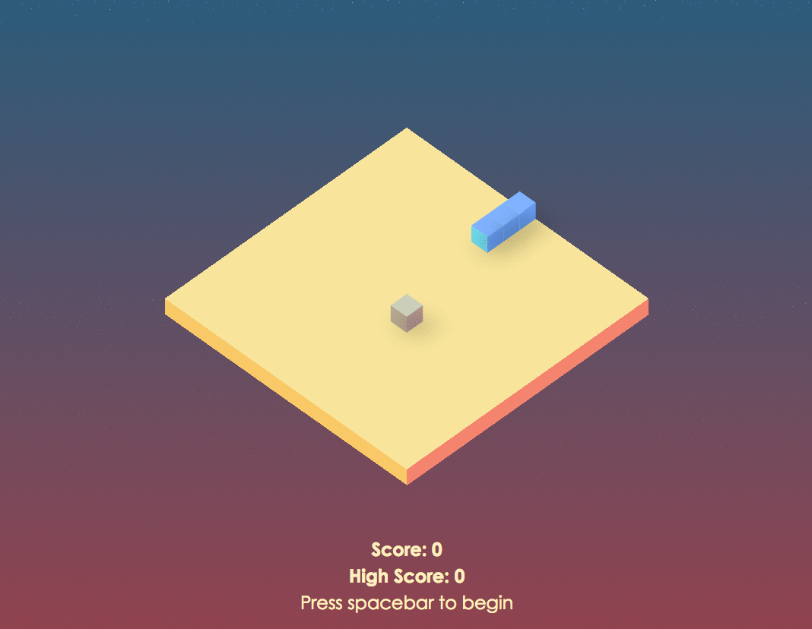

# Snake Redux

An implentation of the class Snake game in both React/Redux and vanilla JavaScript.

### Live at: https://markmarcelo.github.io/snake-redux/

## Redux Implementation
* Extremely decoupled design, all pure functions and immutable data
* No images – uses CSS transforms and psuedo elements to mock three-dimensional geometry

## Vanilla JS Implementation
* Object-oriented prototypal inheritance and functional programing composition
* No images – uses CSS transforms and psuedo elements to mock three-dimensional geometry